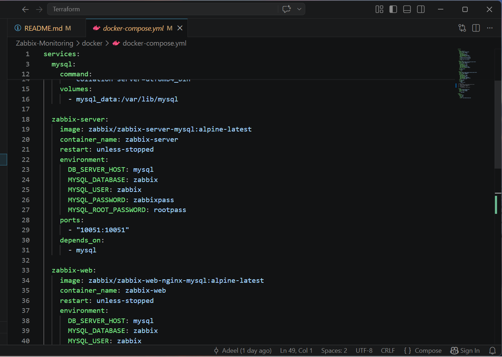
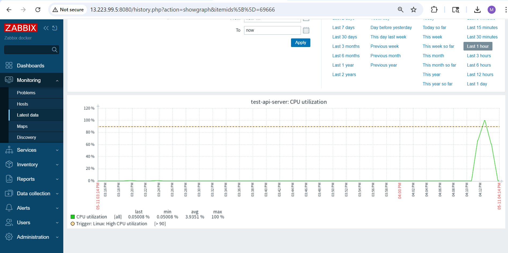
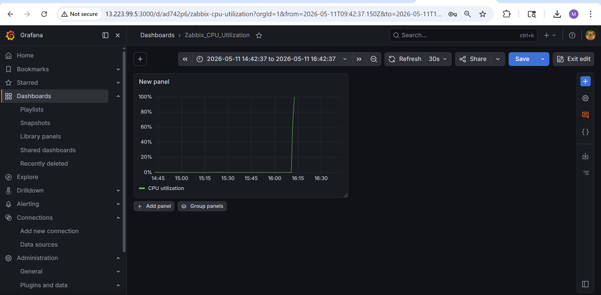
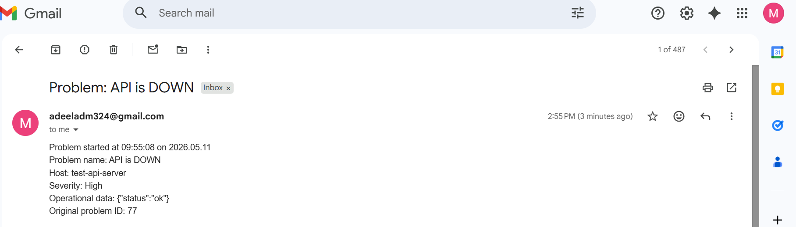

# 🚀 Zabbix Monitoring Stack (Production Ready)

A production-ready monitoring and alerting solution built on AWS using Terraform, Zabbix, and optional Grafana integration.  
This setup provides infrastructure monitoring, API health validation, real-time alerting, and centralized observability for cloud workloads.

---

# 🏗️ Architecture

```text
Application Server (Node.js API)
        │
        ▼
Zabbix Agent 2 (Port 10050)
        │
        ▼
Zabbix Server
        │
 ┌──────┴──────┐
 ▼             ▼
Email Alerts   Grafana Dashboards
```

---

# ⚙️ Tech Stack

| Component | Technology |
|-----------|------------|
| Infrastructure | AWS EC2 / VPC / Security Groups |
| Provisioning | Terraform |
| Monitoring | Zabbix 7.0 LTS |
| Visualization | Grafana |
| Alerting | SMTP Email |
| Application | Node.js / Express |

---

# 💎 Key Features

- ✅ Infrastructure-as-Code powered deployment using Terraform
- ✅ Real-time server monitoring (CPU, RAM, Disk, Network)
- ✅ API `/health` endpoint monitoring
- ✅ Automated email alerting on failures
- ✅ Trigger-based recovery notifications
- ✅ Lightweight Zabbix Agent 2 integration
- ✅ Grafana dashboard support
- ✅ AWS private networking support

---

# 📸 Screenshots

## Infrastructure Deployment


## Zabbix Dashboard


## Grafana Dashboard


## Email Alert


---

# 🛠️ Quick Deployment

## 1️⃣ Deploy Infrastructure

```bash
cd terraform/
terraform init
terraform apply -auto-approve
```

---

## 2️⃣ Install Zabbix Agent on Target Server

```bash
wget https://repo.zabbix.com/zabbix/7.0/ubuntu/pool/main/z/zabbix-release/zabbix-release_latest_7.0+ubuntu22.04_all.deb

sudo dpkg -i zabbix-release_latest_7.0+ubuntu22.04_all.deb

sudo apt update

sudo apt install -y zabbix-agent2
```

Enable and start service:

```bash
sudo systemctl enable zabbix-agent2
sudo systemctl start zabbix-agent2
```

---

## 3️⃣ Configure Zabbix Agent

Edit configuration:

```bash
sudo nano /etc/zabbix/zabbix_agent2.conf
```

Update these values:

```ini
Server=10.0.x.x
ServerActive=10.0.x.x
Hostname=API-Server-01
```

Restart service:

```bash
sudo systemctl restart zabbix-agent2
```

---

## 4️⃣ Verify Connectivity

Run from Zabbix Server:

```bash
zabbix_get -s <AGENT_PRIVATE_IP> -k agent.ping
```

Expected output:

```text
1
```

---

# 🌐 API Health Monitoring

## Sample Test API

Install dependencies:

```bash
npm init -y
npm install express
```

Create `app.js`:

```javascript
const express = require("express");
const app = express();

app.get("/health", (req, res) => {
  res.status(200).json({ status: "ok" });
});

app.listen(3000, "0.0.0.0", () => {
  console.log("API running on port 3000");
});
```

Run application:

```bash
node app.js
```

---

# 🚨 Trigger Configuration

Example trigger expression:

```text
nodata(/test-api-server/api.health,2m)=1
```

Severity:
- High

---

# 📧 Email Alert Workflow

1. Zabbix detects API/server failure
2. Trigger evaluates condition
3. SMTP email alert is sent
4. Recovery notification is triggered automatically after restoration

---

# 📊 Monitoring Scope

- CPU Utilization
- Memory Usage
- Disk Usage
- Network Metrics
- API Health Checks
- Uptime Monitoring

---

# 📈 Grafana Integration

Zabbix API Endpoint:

```text
http://<ZABBIX_SERVER_IP>:8080/zabbix/api_jsonrpc.php
```

Use this endpoint while adding Zabbix as a Grafana datasource.

---

# 🧪 Load Testing

Generate CPU stress:

```bash
stress-ng --cpu 4 --timeout 300s
```

---

# 🛡️ Security Groups

| Port | Purpose |
|------|---------|
| 22 | SSH |
| 10050 | Zabbix Agent |
| 10051 | Zabbix Server |
| 3000 | Test API |
| 8080 | Zabbix UI |

---

# 🧠 Summary

This project delivers a complete production-style monitoring solution using AWS + Terraform + Zabbix.  
It provides proactive alerting, infrastructure visibility, API health validation, and optional Grafana dashboards for centralized observability.

---

# 👨‍💻 Author

Muhammad Adeel

---

# 📌 Status

✅ Production Ready  
✅ Terraform Automated  
✅ Real-Time Alerting Enabled  
✅ Grafana Compatible